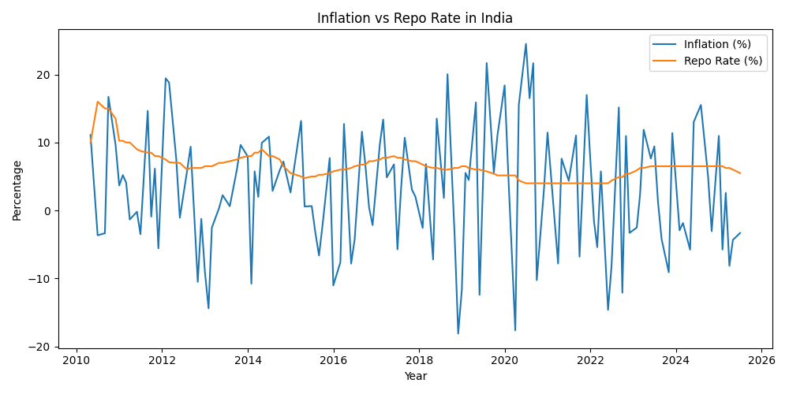

# Inflation-repo-rate-analysis-India
Empirical analysis of CPI inflation and the policy repo rate in India using time-series data. The project involves data cleaning, visualization, and OLS regression in Python to study the relationship between inflation and monetary policy using datasets from the Reserve Bank of India and the Ministry of Statistics and Programme Implementation.
# Inflation–Repo Rate Analysis (India)

## Overview
This project analyzes the relationship between CPI inflation and the policy repo rate in India using time-series data.

## Data Sources
- :contentReference[oaicite:0]{index=0} – Repo Rate
- :contentReference[oaicite:1]{index=1} – CPI Inflation

## Methods
- Data cleaning and formatting using Python (Pandas)
- Time-series trend analysis
- Correlation analysis
- OLS regression and lagged regression models

## Files
- `clean_CPI.csv` – cleaned inflation dataset  
- `clean_repo_rate_monthly.csv` – cleaned repo rate dataset  
- `inflation_repo_clean.csv` – merged dataset used for analysis  
- `trend_analysis.py` – trend visualization  
- `regression_analysis.py` – regression model  
- `lagged_regression.py` – lagged inflation regression model  

## Tools
Python, Pandas, Matplotlib, Statsmodels

## Results

The analysis includes regression outputs and visualizations showing the relationship between CPI inflation and the policy repo rate in India.

### Inflation vs Repo Rate Trend

The visualization illustrates the relationship between CPI inflation and the policy repo rate in India over time. The trend highlights how monetary policy adjustments respond to inflation dynamics.
